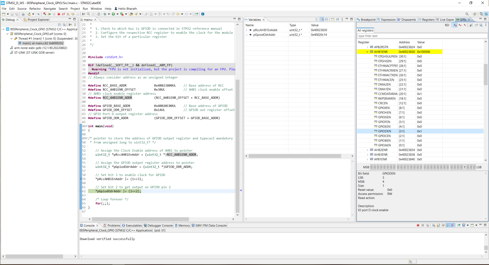
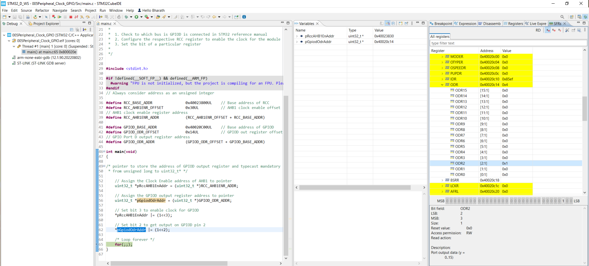

# README #

This README documents the necessary steps to get the `main.c` application up and running.

### What is this repository for? ###

* This repository contains the source code for a test program that configures clock for GPIO Port D  and sets PD2 (pin 2).
* Version: 1.0.0

### Hardware used ###

* [STM32F407G-DISC1](https://www.st.com/en/evaluation-tools/stm32f4discovery.html)

### How do I get set up? ###

* **Summary of set up:** Clone the repository, and import it to STM32CubeIDE. Save and build the project.

* **Configuration:** The program uses the STM32 microcontroller. Make sure your development environment supports this microcontroller.

* **Dependencies:** The program uses the standard inttypes library. Make sure your compiler supports this library.

### Exepected output ###

###### Clock_Enable_for_GPIOD

###### GPIOD_Out_Register_Setbit2

### Reference documents ###

* [Datasheet](https://www.st.com/en/microcontrollers-microprocessors/stm32f407vg.html#)
* [Reference Manual](https://www.st.com/en/microcontrollers-microprocessors/stm32f407vg.html#)